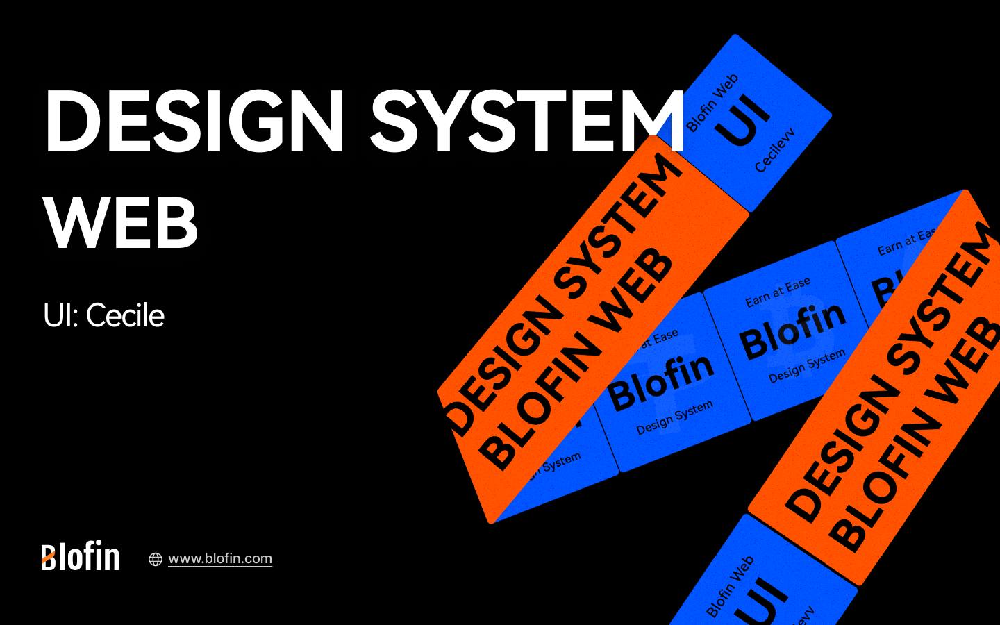

<p align="center">
  <a href="https://blofin.com/" rel="noopener" target="_blank"></a>
</p>

<h1 align="center">Blofin UI</h1>




**UI library for crypto exchanges.**

Introducing our exquisite and sophisticated UI library tailored specifically for discerning crypto exchanges.

Immerse yourself in a world of luxury and elegance as our meticulously crafted design elements seamlessly integrate with the cutting-edge technology of the cryptocurrency industry.

Elevate your user experience to new heights with our high-end interface components, meticulously curated to ensure a seamless and visually stunning trading environment.

With our UI library, you can confidently offer your users a truly elevated and refined trading experience, solidifying your position as a premier destination for secure and stylish cryptocurrency transactions.

## Installation

**NPM**

```bash
npm install blofin-ui
```

**Yarn**

```bash
yarn add blofin-ui
```

## Usage

```jsx
import "src/styles/globals.css";
import { BlofinUiProvider } from "blofin-ui";
import { Button } from "blofin-ui";

<BlofinUiProvider value={{ theme: "light" }}>
  <Component {...pageProps}></Component>
</BlofinUiProvider>;
```

```css
/** global.css */
@import "blofin-ui/blofin.css";
@import "./tailwind.css";

/** tailwind.css */
@tailwind base;
@tailwind components;
@tailwind utilities;
```

## Components

- [x] Button
- [x] Checkbox
- [x] Input
- [x] Select
- [x] Textarea
- [x] Tooltip
- [x] Modal
- [x] Dropdown
- [x] Tabs
- [x] Table
- [x] Pagination
- [x] Loader
- [x] Alert
- [x] Badge
- [x] Card
- [x] Divider
- [x] Silder
- [x] List
- [x] Tag
- [x] Typography
- [x] Avatar
- [x] Icon
- [x] Menu

## Stack we use


## License

This project is licensed under the terms of the
[MIT license](/LICENSE).
